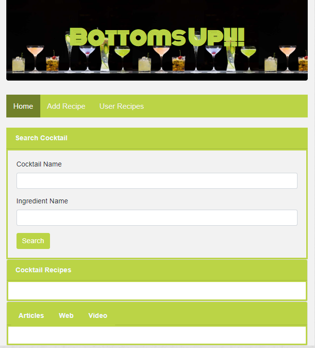

# Group-5 Project

## Project Title: Bottoms Up
* Team Members:
  * Carrie
  * Moto
  * Wilder
  * Zarina

## Project Description:
This website will enable users to search for drink recipes by name and/or ingredient. Search results will show recipes as well as current news/posts/forum posts containing the search term.

## Deployment
*  https://mmakino.github.io/BottomsUp

   

## Repository
* This repository has been forked from where we developed the app originally together in [Carrie's GitHub account](https://github.com/chengyisong/bottomsup). [2/20/2019]

### APIs to be used
API | Description | Auth | HTTPS | CORS
--- | ----------- | ---- | ----- | ----
TheCocktailDB | Cocktail Recipes | apiKey | Yes | Yes
Currents | Latest news published in various news sources, blogs and forums | apiKey | Yes | Yes

### Page layout:
* 3 pages (with a NavBar): 
1. __Search Page__
  * Have an input box, where user can type in a drink name / ingredients
  * Have a “search” button
  * Once user click “search” button, it will use API and populate 2 things:
    * Recipe (from cocktail API)
    * Relevant news/blogs related to the drink (from Currents API)
1. __Submit your own recipe Page__
  * User will input: Name / Drink Name / Ingredients / Instructions
  * And submit button
  * Everything will go to firebase after submitted
1. __User Submitted Recipe Page__
  * A form displaying all user submitted recipes

### Rough Breakdown of Tasks:
API Reference: https://github.com/toddmotto/public-apis

* Everyone:
  * Learn github master/branch/pull request/merge/etc.
* Moto:
  * Search page - API research 
    * NYTimes API (text-to-speech enabled)
    * Google Custom Search
    * YouTube
* Wilder
  * Firebase
  * Submit your own recipe page
* Zarina
  * Search page - API research (cocktail API)
  * Search page - Search Area
* Carrie
  * Firebase
  * Users’ submitted drinks page
